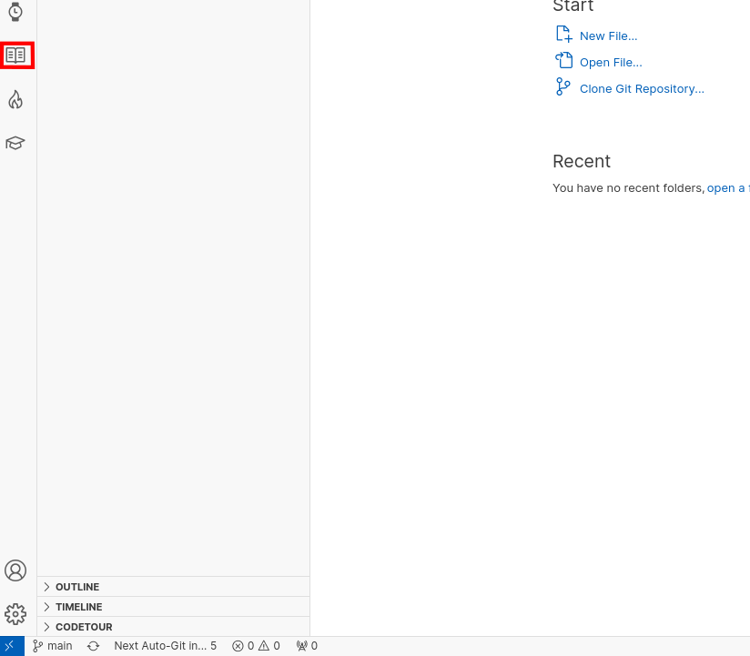

# Tutorial Creator
>#### Providing Better Projects

The Gigo Extension provides a comprehensive way to improve projects for other users by allowing them to create tutorials within their workspace.

### **Creating your first tutorial**

To create a tutorial begin by creating a tutorial by clicking on the tutorial viewer icon (the "Book" icon).

This will open an empty Tutorial Viewer with an "Add Tutorial" button in the top right corner.

